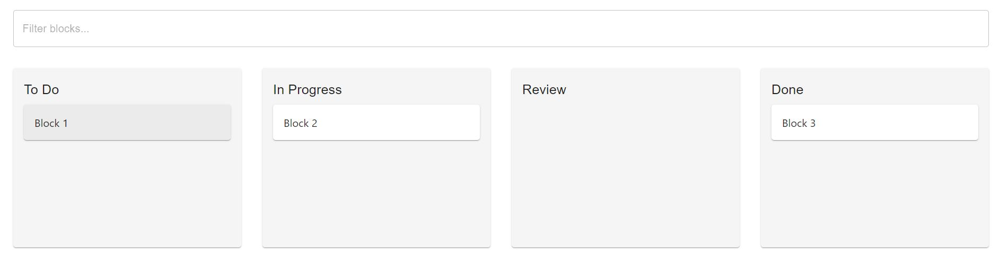

# SwimLaneUi

I've created a React project that implements the swimlane UI with different features. Let me break down the implementation and explain the key parts:

## Features

- Drag and Drop functionality.
- Restricts to move in unspecified Stages.
- Collecting Necessary data before moving the block.
- Showing Details When clicked on particular Block.
- Filtering of the blocks.

## Technologies Used

1. State Management:
   - I have used React's useState hook to manage the state of blocks, selected block, transition dialog, and filter.

2. Drag and Drop:
   - I had utilized the react-beautiful-dnd library to implement drag and drop functionality.
   - The onDragEnd function handles the logic when a block is dropped into a new lane.

3. Transition Rules:
   - I had defined transitionRules to specify allowed transitions between states.
   - When a block is dragged to a new state, we check if the transition is allowed before proceeding.

4. Transition Data:
   - The transitionData object defines the required fields for each state transition.
   - When a valid transition occurs, we show a dialog to collect the necessary data.

5. Block History:
   - Each block maintains a history array that records all transitions, including the data provided during each transition.
   - When a block is clicked, we show a dialog displaying its transition history.

6. Filtering:
   - I have implement a top-level filter input that filters blocks based on their content.

7. UI Components:
   - I have used components from the material-ui library for consistent styling and behavior.

## Setup Instructions

To use this component, you would need to:

1. Install necessary dependencies:
   - react-beautiful-dnd for drag and drop functionality
   - shadcn/ui components

2. Set up your actual data structure and API calls to replace the mock data.

3. Implement proper error handling and validation for user inputs.

4. Optimize performance for large numbers of blocks, possibly by implementing virtualization.

5. Enhance the UI with additional features like adding new blocks, editing block content, etc.

6. Implement proper accessibility features to ensure the UI is usable by all users.

This implementation provides a solid foundation for the swimlane UI with the features like drag and drop the task blocks, History of the Blocks, Assignee of the task, Reviewer of the task etc. You can further customize and extend it based on your specific requirements.

- First, you need to download the code or clone this repository into a specific folder on your system.
- After that, you need to run 'npm install' in that cloned folder  in order to ensure that all the necessary libraries or dependencies are installed properly.
- After that run 'npm start' in that folder and this SwimLaneUI will run.

## Usage/Examples

After the setup is done properly, you can run this. In the user interface, you will be able to manage the different tasks of different type.

## Contributing

Contributions are welcome! If you'd like to contribute to the project, please follow these steps:

- Fork the repository.
- Create a new branch (git checkout -b feature/improvement).
- Make your changes.
- Commit your changes (git commit -am 'Add new feature').
- Push to the branch (git push origin feature/improvement).
- Create a new Pull Request